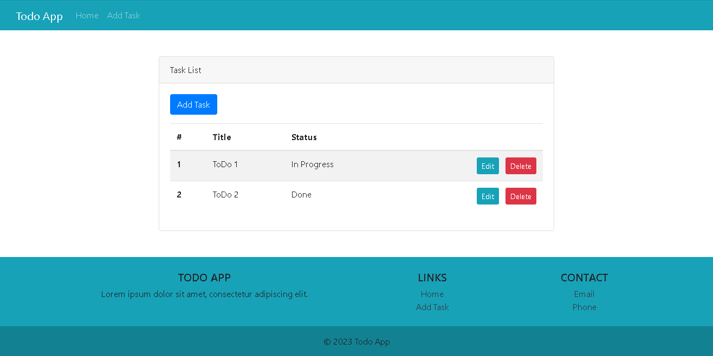
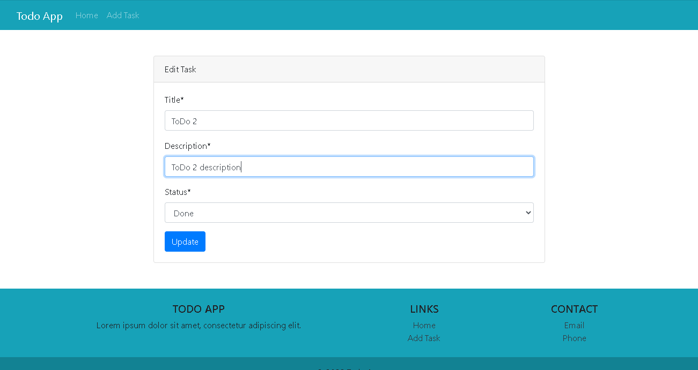

# ToDo loyihasiga hush kelibsiz
- ishga tushirishdan oldin `.env` fayliga `debug` va `secret_key` qiymatlarni berib oling
- so'ngra `python manage.py makemigrations` qilib migratsion fayllarni yaratib oling
- keyin `python manage.py migrate` qilib DB ga ma'lumotlarni yozib olamiz,shu bilan loyiha ishga tushadi

## Home Page

## Edit page

